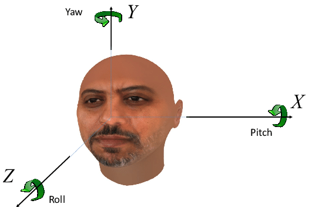
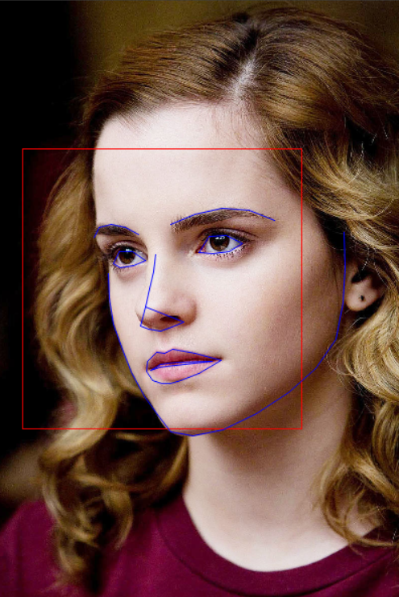
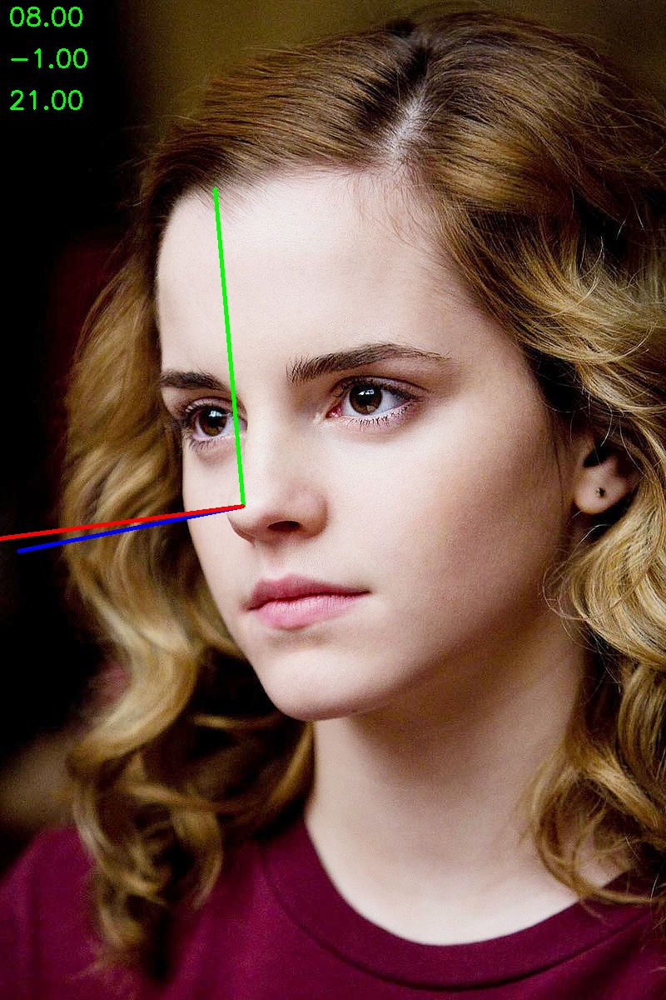

# Roll Yaw Pitch Angles
Calculations of Roll Yaw and Pitch angles from a give image that can estimate a face posture of any image.

====

Numpy & OpenCV implementation of [Head Pose Estimation on Top of Haar-Like Face Detection: A Study Using the Kinect Sensor](https://www.researchgate.net/figure/The-head-pose-rotation-angles-Yaw-is-the-rotation-around-the-Y-axis-Pitch-around-the_fig1_281587953)



Prerequisites
-------------
* [Python 3.5.2](https://www.python.org/downloads/release/python-352/)
* [Numpy](https://pypi.org/project/numpy/)
* [OpenCV 4.1.1](http://opencv.org/releases.html)


We recommend pasting the following instuctions in command prompt after Python Installation.
```
   pip install numpy
   pip install opencv-python
```

Usage
-------------

First, download the [landmark file](https://drive.google.com/open?id=1IvRosjxfWp8nK3ZShxVaryKLBxmtu0Mh) here. When files are download, open "pose_estimation.py" and right at the end of code, provide Landmark file path as well as image path from which you want to calculate roll, yaw and pitch angles.


To get your results write this command in your command prompt :
```
$ python pose_estimation.py
```

Results
-------------
After Calculating 68 Facial Features, it will calculate roll yaw and pitch angles so to better estimate pose of your image. Final Results will disply two images, one where landmarks are detected, and other where those angles are calculated.

 


Author
------------
Zeeshan Badar 
Email: mail@zeeshan.engineer
